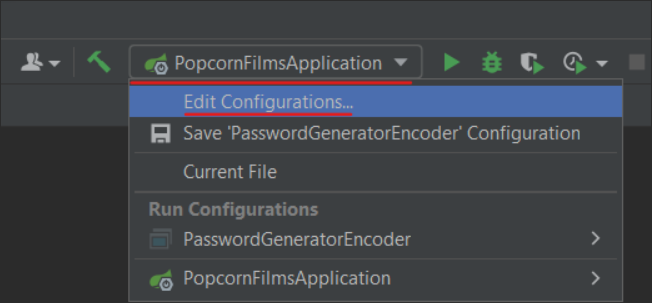
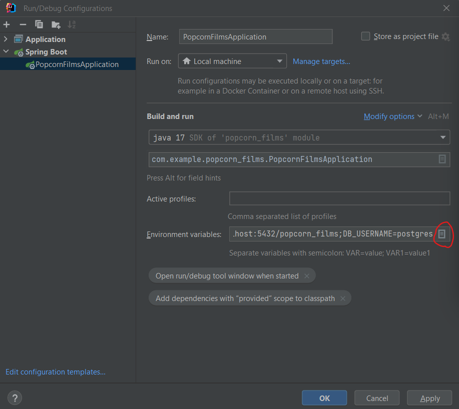

# Popcorn Films
Popcorn Films is a Java-based project that allows users to browse and manage a collection of movies. 
This README provides instructions on how to set up the project and get it running on your local environment.
## Prerequisites
Before setting up the Popcorn Films Java project, you'll need the following software installed on your machine:

* Java Development Kit (JDK) 17 or higher
* PostgreSQL
## Setup Instructions
Follow the steps below to set up the Popcorn Films Java project:

1. Clone the project repository from GitHub to your local machine using the following command:
```git clone https://github.com/sergoliarnik/popcorn_films.git```
2. Open project in IntelliJ IDEA Ultimate Edition
3. Set properties
   

    

    

    
4. Press run
5. The Popcorn Films application should now be running locally on your machine. 
6. You can access it's Swagger in your web browser 
 at http://localhost:8080/swagger-ui/index.html#/.
7. You can now use the Popcorn Films application to browse and manage
movies by accessing the various endpoints provided by the application.
## Project Structure
The Popcorn Films Java project follows the standard Maven project structure, with the following key directories:

* `src/main/java`: Contains the Java source code of the project.
* `src/main/resources`: Contains the configuration files, such as application.properties, for the project.
* `src/test/java`: Contains the unit tests for the project.
* `target`: Contains the compiled output and build artifacts generated by Maven.

## Technologies Used
The Popcorn Films Java project uses the following technologies:

* Spring Boot: A popular Java framework for building web applications.
* Spring MVC: A part of the Spring framework that provides support for building web applications using the Model-View-Controller (MVC) pattern.
* Spring Data JPA: A part of the Spring framework that provides support for working with databases using the Java Persistence API (JPA).
* PostgreSQL: A popular relational database management system.

## Conclusion
That's it! You've successfully set up the Popcorn Films Java project on your local machine. You can now start exploring 
and customizing the application to suit your needs. If you encounter any issues or have questions, please refer to the 
project's documentation or seek help from the project's contributors. 
Happy movie browsing with Popcorn Films!


